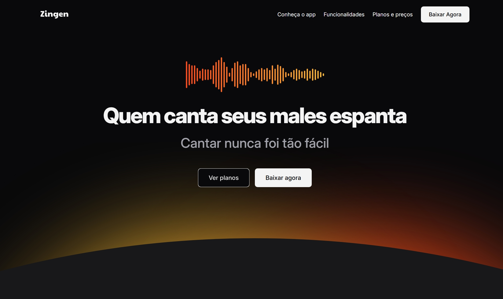

# Projeto Zingen



Este projeto foi desenvolvido durante o curso Full-Stack da Rocketseat. O objetivo principal foi criar um site responsivo com ênfase em mobile first.

## Tecnologias Utilizadas

- HTML5
- CSS3

## Funcionalidades

- Design responsivo
- Mobile First
- Interface amigável para dispositivos móveis
- Integração com backend utilizando Node.js

## Instalação

1. Clone o repositório:
   ```bash
   git clone https://github.com/seu-usuario/zingen.git
   ```
2. Instale as dependências:
   ```bash
   npm install
   ```
3. Inicie o servidor:
   ```bash
   npm start
   ```

## Contribuição

Sinta-se à vontade para contribuir com o projeto. Faça um fork, crie uma branch e envie um pull request.

## Licença

Este projeto está licenciado sob a licença MIT.
